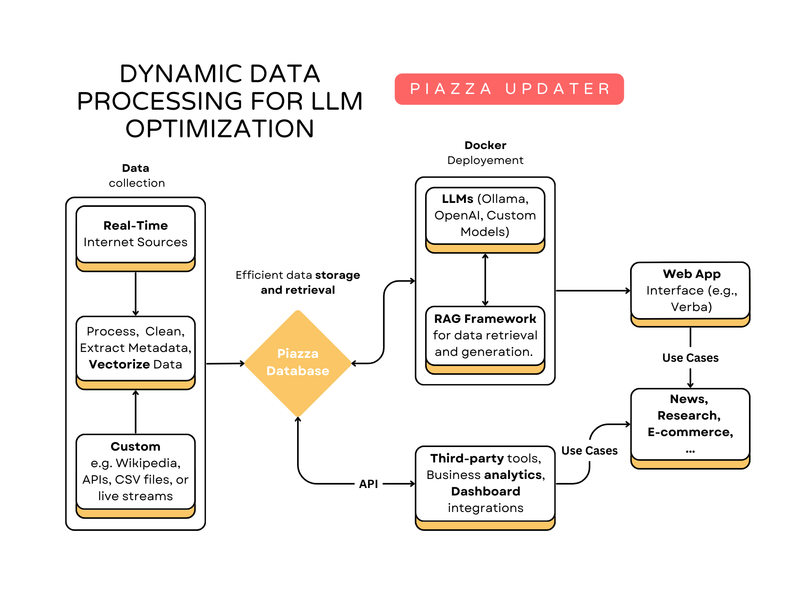

# Piazza AI: Wikipedia Updater Framework

Welcome to the **Piazza Updater**, a framework developed by **Piazza AI** that demonstrates the power of **Weaviate vector databases** combined with **real-time data updates**. This repository is an open-source demo showcasing how our framework processes Wikipedia data, fetches new information in real-time from the web, and updates a vector database. The goal is to simplify **Large Language Model (LLM) deployments** by leveraging advanced techniques like **Retrieval-Augmented Generation (RAG)**.

---

## Piazza Workflow

<div style="text-align: center;">
    
</div>

## How to Run the Demo

### Prerequisites
1. **Docker**: Ensure Docker is installed on your machine.
2. **API Keys**: Create a `.env` file to include API keys required for other modules (e.g., OpenAI, Anthropic). Refer to the [Verba repository](https://github.com/weaviate/Verba) for details.

### Steps to Run
1. Clone this repository and install dependencies
   ```bash
   git clone https://github.com/piazza-tech/Piazza-Updater.git
   cd Piazza-Updater
   pip install -r requirements.txt
   ```

2. Provide execution permissions for the `start.sh` script:
   ```bash
   chmod +x start.sh
   ```

3. Run the framework:
   ```bash
   ./start.sh
   ```

4. Open your browser and navigate to `http://localhost:8000`.

5. In the Verba web interface:
   - Choose **Docker Deployment**.
   - Select **Documents** to observe Wikipedia data being processed and updated in real-time.

6. Once the initial Wikipedia dumps are processed:
   - The script begins searching the internet for new data.
   - Chat with the LLM using up-to-date information!

---

### Configuration Options
1. **Development Mode**:
   - Skip the `PRODUCTION` variable in `.env` for a lightweight demo (processes a small subset of Wikipedia).
   - Use `docker-compose-s.yml` for minimal resource usage.

2. **Production Mode**:
   - Add the `PRODUCTION` variable in `.env` to process the entire Wikipedia dataset.
   - Use `docker-compose.yml` for full-scale deployment (requires more time and resources).

---

## Technologies Used
- **Weaviate**: Vector database for efficient semantic search and data retrieval.
- **LLMs**: Powered by **Ollama Llama 3.2** for natural language understanding.
- **RAG Framework**: Combines vectorized data with real-time search to enhance LLM performance.
- **Verba**: Web app for seamless user interaction and deployment ([learn more](https://github.com/weaviate/Verba)).

---

## Use Cases Beyond Wikipedia
While this demo focuses on Wikipedia, the Piazza Updater framework is highly adaptable:
- Integrate with any database or website.
- Fetch and process real-time internet data for various domains, such as:
  - News websites
  - E-commerce platforms
  - Scientific research databases

---

## License
This project is open-source under the [MIT License](LICENSE).

---

## Contributing
We welcome contributions to enhance this demo! Feel free to fork the repository, make changes, and submit pull requests.

---

For questions or support, reach out to **Piazza AI** or visit the [Verba repository](https://github.com/weaviate/Verba) for additional deployment details. 

Start exploring the future of real-time LLMs today! 🚀
